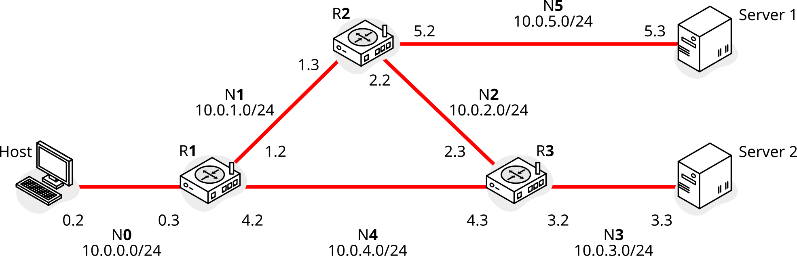

## Topology

AVISO: Este ejemplo NO FUNCIONA. Trabajo en progreso.

Configuración:

RP (Rendezvous Point)

Recibir tráfico mcast:

    $ iperf -s -u -B 239.1.1.1

Enviar tráfico mcast:

    $ iperf -c 239.1.1.1 -u -t 1

En el router cercano al emisor deberías ver:

    $ docker exec r1 vtysh -c "show ip pim upstream"
    Iif      Source  Group            State  Uptime    JoinTimer  RSTimer   KATimer   RefCnt
    Unknown  *       239.255.255.250  NotJ   00:18:17  --:--:--   --:--:--  --:--:--  1

- Debería estar el grupo 239.1.1.1

Y en el cercano al receptor:

    $ docker exec r3 vtysh -c "show ip pim join"
    Interface  Address   Source  Group      State   Uptime    Expire  Prune
    eth2       10.0.3.2  *       239.1.1.1  NOINFO  --:--:--  --:--   --:--

Cada router PIM ve a los otros dos:

    $ docker exec r1 vtysh -c "show ip pim neig"
    Interface  Neighbor  Uptime    Holdtime  DR Pri
    eth1       10.0.1.3  00:19:27  00:01:18  1
    eth2       10.0.4.3  00:19:27  00:01:18  1

Qué interfaces llevan a routers PIM:

    $ docker exec r1 vtysh -c "show ip pim interface"
    Interface  State  Address   PIM Nbrs  PIM DR    FHR  IfChannels
    eth0       up     10.0.0.3  0         local     0    1
    eth1       up     10.0.1.2  1         10.0.1.3  0    0
    eth2       up     10.0.4.2  1         10.0.4.3  0    0
    pimreg     up     0.0.0.0   0         local     0    0

Comprobar:

- https://github.com/FRRouting/frr/issues/2326
- https://github.com/ksator/frrouting_demo
- https://docs.nvidia.com/networking-ethernet-software/cumulus-linux-37/Layer-3/Protocol-Independent-Multicast-PIM/
