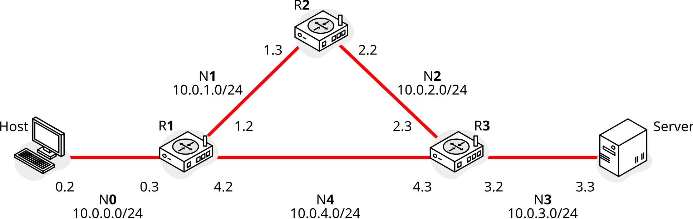

## Topology

## Static routing

Setup:

    $ make static

Show routing tables:

    $ docker exec r1 ip route
    default via 10.0.4.3 dev eth1
    10.0.0.0/24 dev eth2 proto kernel scope link src 10.0.0.3
    10.0.1.0/24 dev eth0 proto kernel scope link src 10.0.1.2
    10.0.4.0/24 dev eth1 proto kernel scope link src 10.0.4.2

Ping Server:

    $ ping -c1 10.0.3.3
    PING 10.0.3.3 (10.0.3.3) 56(84) bytes of data.
    64 bytes from 10.0.3.3: icmp_seq=1 ttl=62 time=0.164 ms

Traceroute Server:

    $ traceroute 10.0.3.3
    traceroute to 10.0.3.3 (10.0.3.3), 30 hops max, 60 byte packets
    1  10.0.0.3 (10.0.0.3)  0.361 ms  0.309 ms  0.293 ms
    2  10.0.4.3 (10.0.4.3)  0.280 ms  0.252 ms  0.235 ms
    3  10.0.3.3 (10.0.3.3)  0.219 ms  0.191 ms  0.171 ms

## RIP

Setup:

    $ make rip

Check config:

    $ docker exec r1 ip route
    default via 10.0.4.3 dev eth2
    10.0.0.0/24 dev eth0 proto kernel scope link src 10.0.0.3
    10.0.1.0/24 dev eth1 proto kernel scope link src 10.0.1.2
    10.0.2.0/24 nhid 10 via 10.0.1.3 dev eth1 proto rip metric 20
    10.0.3.0/24 nhid 12 via 10.0.4.3 dev eth2 proto rip metric 20
    10.0.4.0/24 dev eth2 proto kernel scope link src 10.0.4.2

    $ docker exec r1 vtysh -c "show running-config"
    Building configuration...

    Current configuration:
    !
    frr version 8.4.4
    frr defaults traditional
    hostname r1
    no ipv6 forwarding
    service integrated-vtysh-config
    !
    router rip
    network 10.0.0.0/24
    network 10.0.1.0/24
    network 10.0.4.0/24
    exit
    !
    end

Show routing info:

    $ docker exec r1 vtysh -c "show ip route"
    Codes: K - kernel route, C - connected, S - static, R - RIP,
        O - OSPF, I - IS-IS, B - BGP, E - EIGRP, N - NHRP,
        T - Table, v - VNC, V - VNC-Direct, A - Babel, F - PBR,
        f - OpenFabric,
        > - selected route, * - FIB route, q - queued, r - rejected, b - backup
        t - trapped, o - offload failure

    K>* 0.0.0.0/0 [0/0] via 10.0.4.3, eth2, 00:00:30
    C>* 10.0.0.0/24 is directly connected, eth0, 00:00:30
    C>* 10.0.1.0/24 is directly connected, eth1, 00:00:30
    R>* 10.0.2.0/24 [120/2] via 10.0.1.3, eth1, weight 1, 00:00:24
    R>* 10.0.3.0/24 [120/2] via 10.0.4.3, eth2, weight 1, 00:00:24
    C>* 10.0.4.0/24 is directly connected, eth2, 00:00:30

Show RIP info:

    $ docker exec r1 vtysh -c "show ip rip"
    Codes: R - RIP, C - connected, S - Static, O - OSPF, B - BGP
    Sub-codes:
        (n) - normal, (s) - static, (d) - default, (r) - redistribute,
        (i) - interface

        Network            Next Hop         Metric From            Tag Time
    C(i) 10.0.0.0/24        0.0.0.0               1 self              0
    C(i) 10.0.1.0/24        0.0.0.0               1 self              0
    R(n) 10.0.2.0/24        10.0.1.3              2 10.0.1.3          0 02:48
    R(n) 10.0.3.0/24        10.0.4.3              2 10.0.4.3          0 02:57
    C(i) 10.0.4.0/24        0.0.0.0               1 self              0

## OSPF

Setup:

    $ make ospf

Show routing info:

    $ docker exec r1 vtysh -c "show ip route"
    Codes: K - kernel route, C - connected, S - static, R - RIP,
        O - OSPF, I - IS-IS, B - BGP, E - EIGRP, N - NHRP,
        T - Table, v - VNC, V - VNC-Direct, A - Babel, F - PBR,
        f - OpenFabric,
        > - selected route, * - FIB route, q - queued, r - rejected, b - backup
        t - trapped, o - offload failure

    O   10.0.0.0/24 [110/10] is directly connected, eth2, weight 1, 00:01:14
    C>* 10.0.0.0/24 is directly connected, eth2, 00:01:15
    O   10.0.1.0/24 [110/10] is directly connected, eth0, weight 1, 00:01:14
    C>* 10.0.1.0/24 is directly connected, eth0, 00:01:15
    O>* 10.0.2.0/24 [110/20] via 10.0.1.3, eth0, weight 1, 00:00:24
    *                      via 10.0.4.3, eth1, weight 1, 00:00:24
    O>* 10.0.3.0/24 [110/20] via 10.0.4.3, eth1, weight 1, 00:00:24
    O   10.0.4.0/24 [110/10] is directly connected, eth1, weight 1, 00:00:34
    C>* 10.0.4.0/24 is directly connected, eth1, 00:01:15

Show OSPF info:

    $ docker exec r1 vtysh -c "show ip ospf"
    OSPF Routing Process, Router ID: 10.0.4.2
    Supports only single TOS (TOS0) routes
    This implementation conforms to RFC2328
    RFC1583Compatibility flag is disabled
    OpaqueCapability flag is disabled
    Initial SPF scheduling delay 0 millisec(s)
    Minimum hold time between consecutive SPFs 50 millisec(s)
    Maximum hold time between consecutive SPFs 5000 millisec(s)
    Hold time multiplier is currently 1
    SPF algorithm last executed 34.960s ago
    Last SPF duration 52 usecs
    SPF timer is inactive
    LSA minimum interval 5000 msecs
    LSA minimum arrival 1000 msecs
    Write Multiplier set to 20
    Refresh timer 10 secs
    Maximum multiple paths(ECMP) supported 256
    Administrative distance 110
    This router is an ASBR (injecting external routing information)
    Number of external LSA 0. Checksum Sum 0x00000000
    Number of opaque AS LSA 0. Checksum Sum 0x00000000
    Number of areas attached to this router: 1
    Area ID: 0.0.0.0 (Backbone)
      Number of interfaces in this area: Total: 3, Active: 3
      Number of fully adjacent neighbors in this area: 2
      Area has no authentication
      SPF algorithm executed 5 times
      Number of LSA 6
      Number of router LSA 3. Checksum Sum 0x00017f9a
      Number of network LSA 3. Checksum Sum 0x000173dc
      Number of summary LSA 0. Checksum Sum 0x00000000
      Number of ASBR summary LSA 0. Checksum Sum 0x00000000
      Number of NSSA LSA 0. Checksum Sum 0x00000000
      Number of opaque link LSA 0. Checksum Sum 0x00000000
      Number of opaque area LSA 0. Checksum Sum 0x00000000
